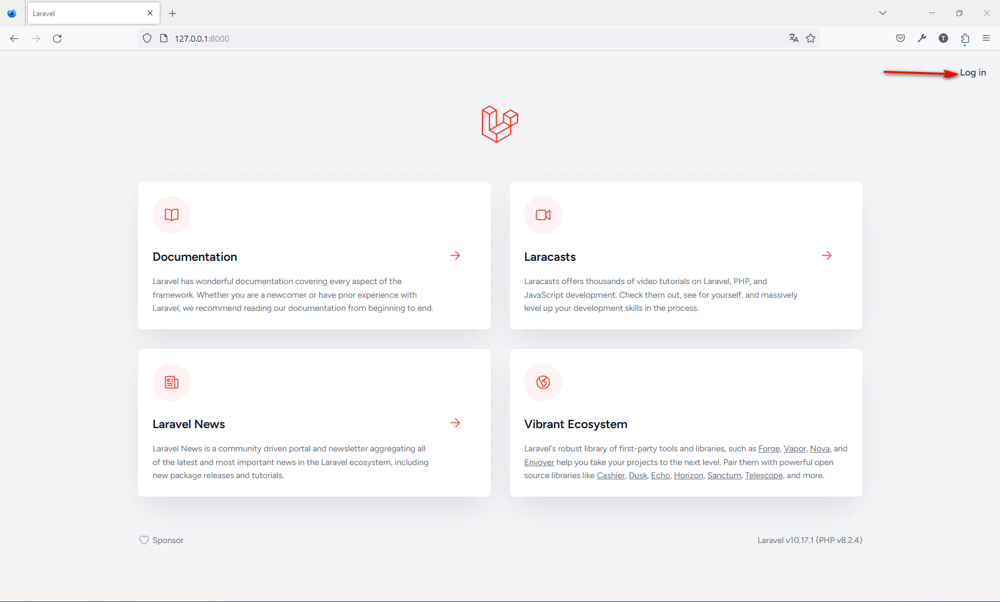
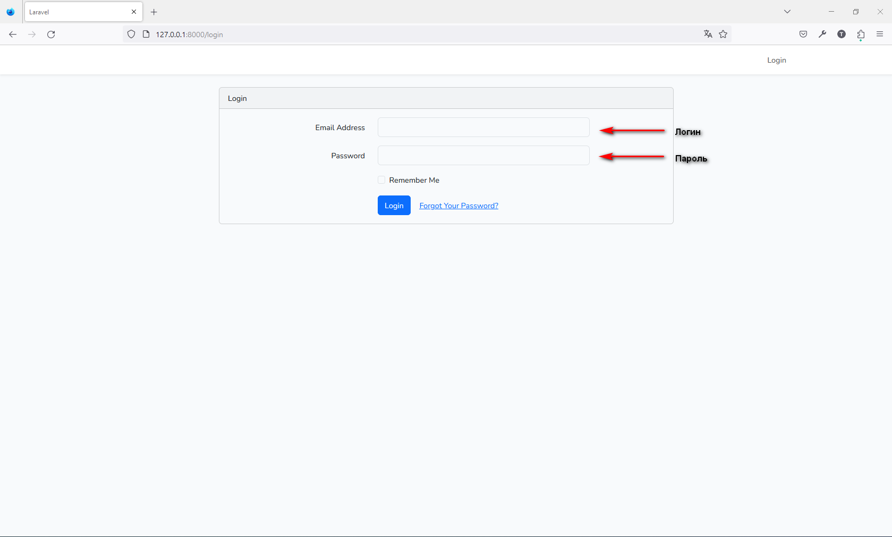
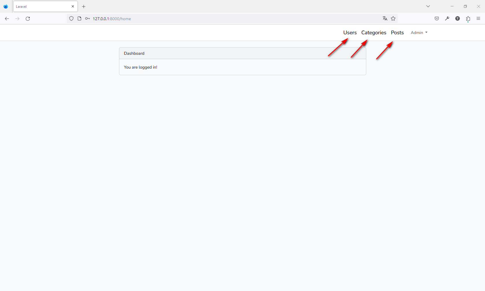
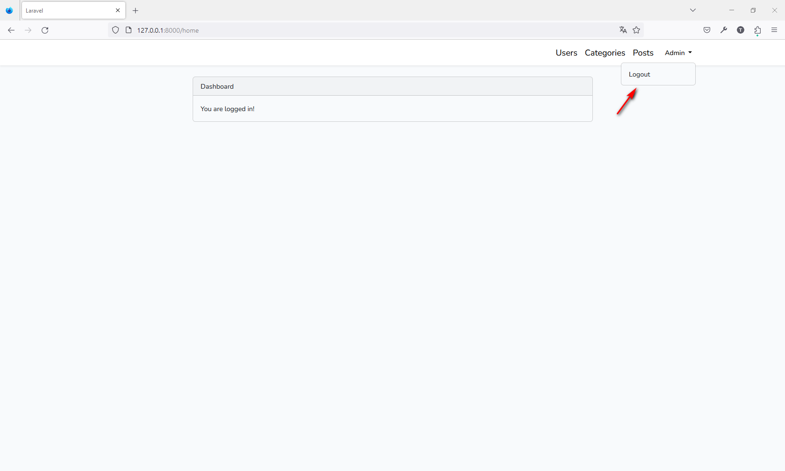
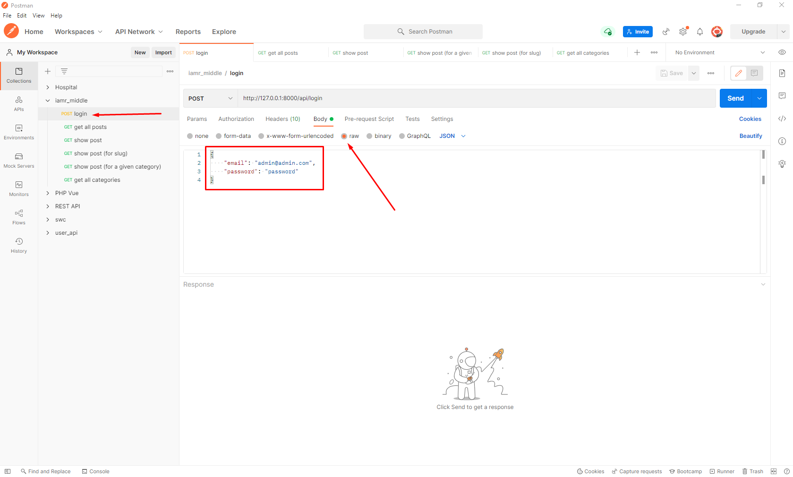
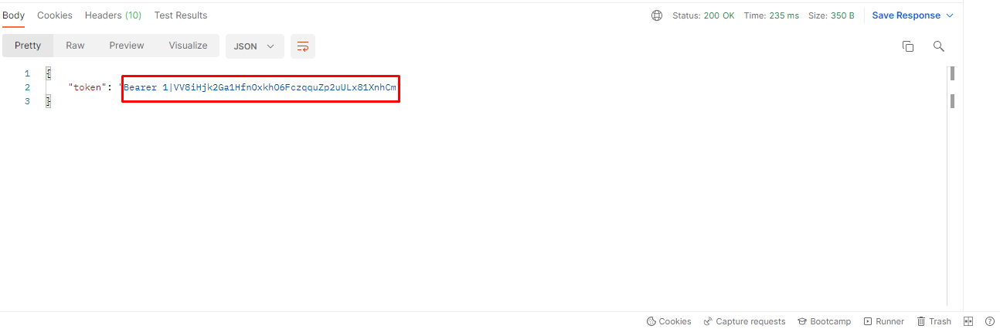
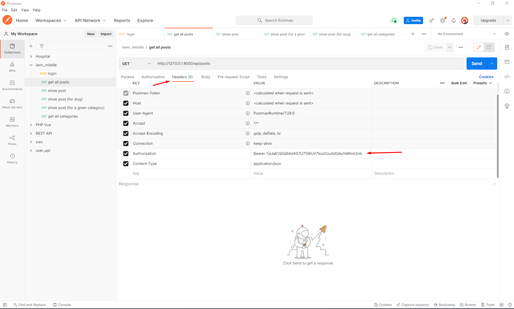

# ООО Международная Академия Медицинской Реабилитации


### Настроить приложение

Создать базу данных.

Скопируйте и отредактируйте файл `.env` и введите данные своей базы данных:

```
cp .env.example .env
```

Установите зависимости проекта и запустите сервер PHP:

```
composer install
```
```
php artisan serve

npm run dev
```

Перенос таблиц с помощью сидов:

```
php artisan migrate --seed
```
Или обновить таблицы:

```
php artisan migrate:refresh --seed
```

Загрузка [127.0.0.1:8000](127.0.0.1:8000).

Нажмите на "Log in"



Для входа и работы иползете следующие данные

```
Логин - admin@admin.com
Пароль - password
```


На панели навигации будут видны соответствующие разделы




### Работы с api

Для удобства можете импортировать с json файла `iamr_middle.postman_collection.json` который находитсй а корне проекита.


Сначала нужно сгенерировать токен




```
{
    "email": "admin@admin.com",
    "password": "password"
}
```



Полученный код скопировать и вставить сатвестущее поле запроса


